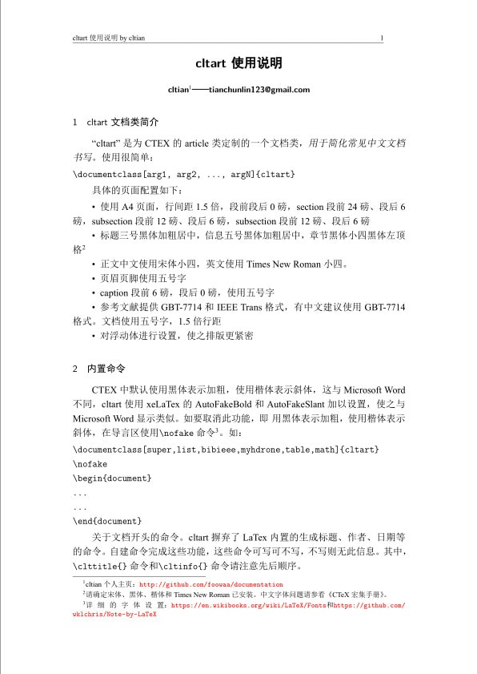

# cltart



What's it?
==========

**cltart** is a LaTeX documentclass for Chinese article writting in order to
make it easy to write and good to look.

**cltart**是一个LaTex文档类，用于中文文章书写。其目的是简化书写过程和让文档外观更适于中文环境。

版权须知
========
**cltart** obeys MIT License. Feel free to use!!

The author is cltian (email: tianchunlin123@gmail.com).

使用须知
========

1. 本模板强烈建议使用texlive 2014或以上版本。

2. 确保当前系统已安装配置SimSun，SimHei，KaiTi，Times New Roman字体，如果您使用的是Linux和Mac OSX系统，请自行
以“fc-cache 添加 win 字体”为关键字通过Google搜索解决方案)。

3. 您可以使用各种编辑器环境，但是要确保使用XeLatex方式进行编译。

使用方法
========
1. 如果您使用编辑器IDE环境如TexWorks，Texstudio，Winedt等，请务必将编译方式设置为xelatex + bibtex方式。

2. 简单使用方法如下：

```latex
\documentclass{cltart}
```
引入后即可开始书写。

3. 完全使用方法见`manual.pdf`

如何获取/升级
=============
1. 如需以git方式获取，git clone https://github.com/foowaa/cltart
2. 如需直接获取压缩包文件，请下载 https://github.com/foowaa/cltart/archive/master.zip

资源
=============
> [1] [LaTex wiki book](https://en.wikibooks.org/wiki/LaTeX)
>
> [2] [The Not So Short Introduction To LaTeX (Chinese Edition)](https://github.com/CTeX-org/lshort-cn)
>
> [3] [ctex文档](http://mirrors.ibiblio.org/CTAN/language/chinese/ctex/ctex.pdf)
> 
> [4] [xecjk文档](http://mirrors.ibiblio.org/CTAN/macros/xetex/latex/xecjk/xeCJK.pdf)
>
> [4] [LaTex-Project](https://www.latex-project.org/)
